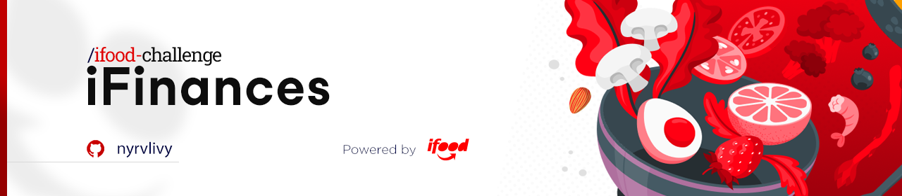
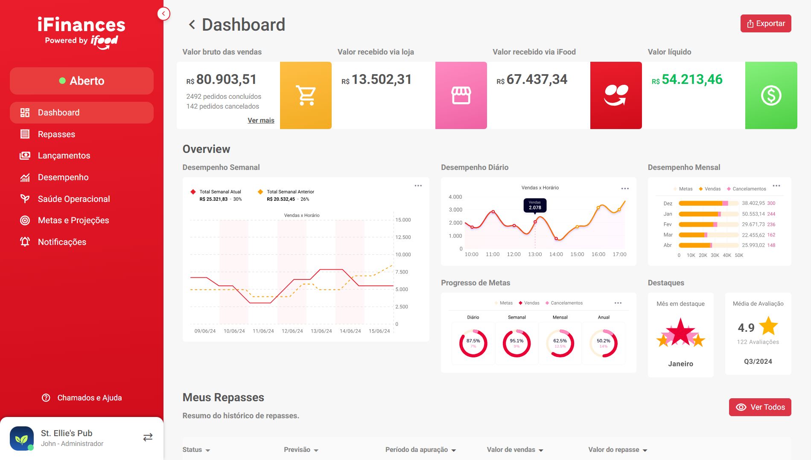
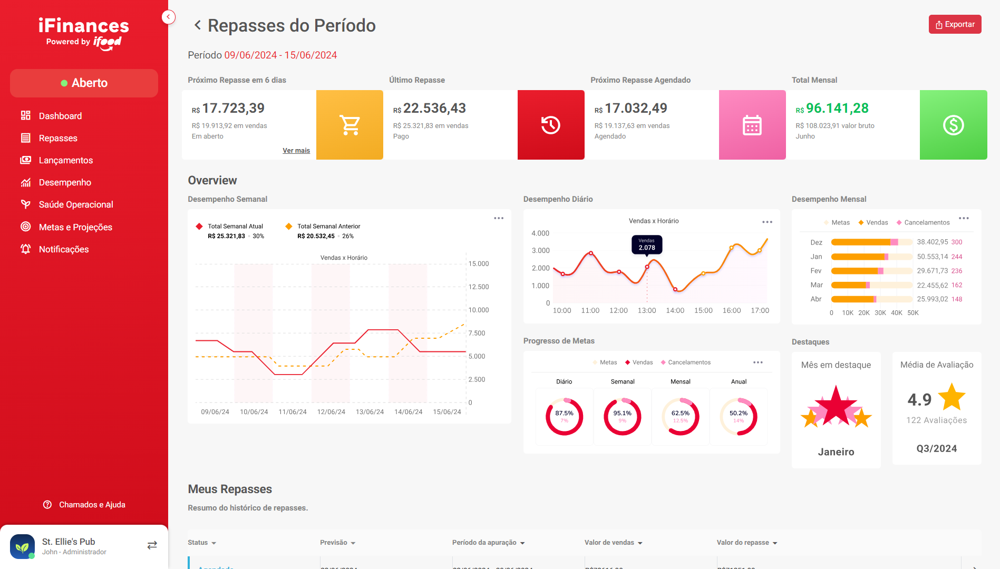
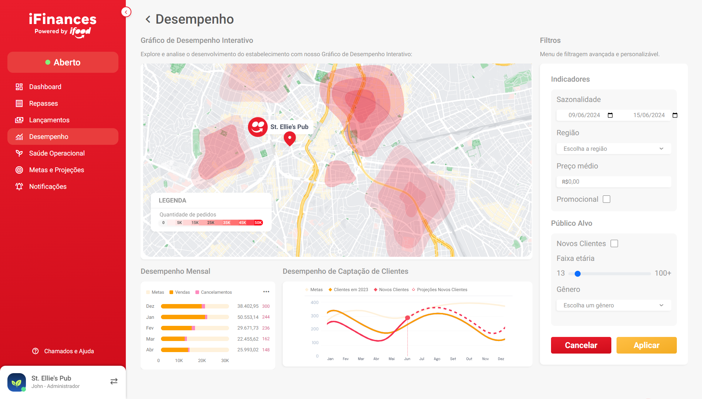
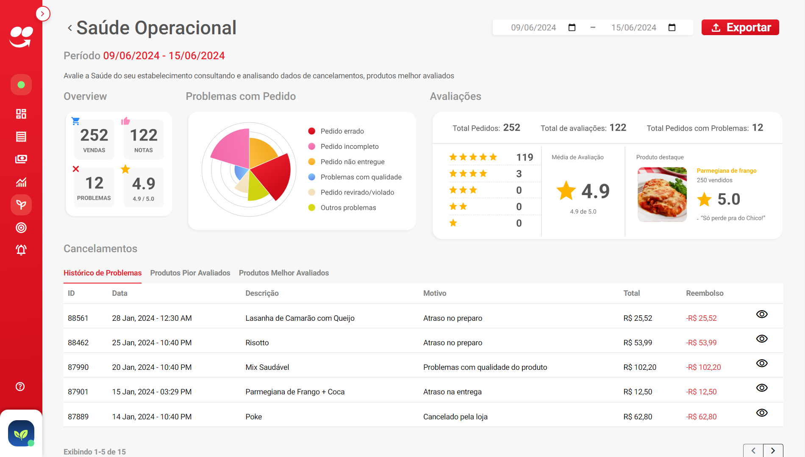
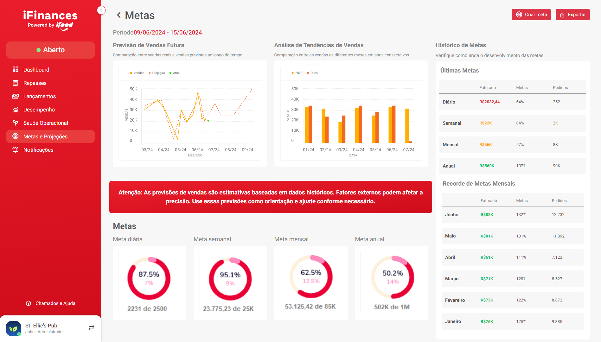

<div align="center">
  
</div>

<h1 align="center">iFood Web Challenge</h1>
<p align="center">Projeto de Desenvolvimento Backend: Construção de uma API RESTful em Java com Spring Boot para Gerenciamento de Transações Financeiras.</p>

<div align="center">

  
  
  
  

</div>

##

## Tabela de Conteúdos

* [Descrição do Projeto](#descrição-do-projeto)
* [Como Configurar?](#como-configurar)
* [Overview](#overview)
* [Páginas](#páginas)
    <details>
    <summary>Click to expand</summary>

  - [Dashboard](#dashboard)
  - [Repasses](#repasses)
  - [Repasses por Período](#repasses-por-período)
  - [Lançamentos](#lançamentos)
  - [Lançamentos do Repasse](#lançamentos-do-repasse)
  - [Desempenho](#desempenho)
  - [Saúde Operacional](#saúde-operacional)
  - [Metas e Projeções](#metas-e-projeções)
  - [Modals](#modals)
      - Modal de Notificações
      - Modal de Permissões
      - Modal Sobre
  - [Navbar e Sidebar](#navbar-e-sidebar)

  </details>
  
* [Documentação](#documentação)

##

## Descrição do Projeto

Este projeto consiste em uma aplicação web de backoffice, desenvolvida com Bootstrap, voltada para a gestão financeira de parceiros do iFood. O objetivo principal é proporcionar uma solução segura e eficiente para controlar saldos, transações e pagamentos, além de gerar relatórios detalhados. 

Suas principais funcionalidades incluem:

1. Dashboard Financeiro: Resumo de saldos, receitas, despesas e relatórios analíticos.
2. Consulta de Saldo e Transações: Visualização detalhada de saldos e histórico de transações, com filtros avançados.
3. Gestão de Pagamentos e Recebíveis: Ferramentas para controlar fluxos financeiros.
4. Relatórios e Análises: Geração de relatórios financeiros para tomada de decisões.
5. Segurança e Controle de Acesso: Proteção de dados com níveis de permissão variados.

A aplicação prioriza a experiência do usuário com design responsivo, garantindo fácil navegação em diferentes dispositivos.

##

## Como Configurar?

- [x] Faça um fork deste repositório para o seu GitHub.;
- [ ] Clone o repositório na sua máquina;

```bash
    git clone https://github.com/Nyrvlivy/iFood-Web-Challenge
```

#### Configure o ambiente de desenvolvimento:

- [ ] Certifique-se de ter o [Live Server](https://marketplace.visualstudio.com/items?itemName=ritwickdey.LiveServer) instalado no Visual Studio Code.
- [ ] Abra o projeto no VS Code e clique com o botão direito no arquivo `index.html`, escolhendo a opção _"Open with Live Server"_.

> O **Live Server** é necessário para permitir que o navegador acesse rotas e arquivos dinâmicos corretamente, como os gerados por JavaScript, assim, evitando erros de carregamento ao acessar diretamente o `index.html`. 
> 
> _Como funciona?_ Ele cria um ambiente de servidor local onde o roteamento das páginas é suportado adequadamente.

- [ ] Após iniciar o servidor, você poderá acessar a aplicação pelo navegador no endereço gerado, normalmente `http://127.0.0.1:3000/` ou `http://127.0.0.1:5500/`.
- [ ] Divirta-se! 🎊👏

##

## Overview

Com foco na experiência do usuário, a aplicação oferece uma interface intuitiva e um design responsivo, adaptando-se perfeitamente a diferentes dispositivos, garantindo uma navegação fluida e eficiente.

<div align="center">
  
  <br>
  Para mais informações, clone o repositório e divirta-se!
</div>

##

## Páginas

Resumo das principais páginas e funcionalidades da aplicação:

<details>
<summary>Click to expand</summary>

### Dashboard
    Aqui encontramos uma visão geral do saldo, receitas, despesas e indicadores financeiros do negócio.

<div align="center">
  
  <br>
</div>

### Repasses
    Exibe informações detalhadas sobre repasses financeiros, como datas, valores e status dos pagamentos.

<div align="center">
  
  <br>
</div>

### Repasses por Período
    Permite a visualização e filtragem dos repasses dentro de um intervalo de tempo específico.

<div align="center">
  
  <br>
</div>

### Lançamentos
    Lista todos os lançamentos financeiros, permitindo o acompanhamento das movimentações no sistema.

<div align="center">
  
  <br>
</div>

### Lançamentos do Repasse
    Detalha as entradas e saídas relacionadas a cada repasse efetuado, com opções de filtragem.

<div align="center">
  
  <br>
</div>

### Desempenho
    Mostra métricas de desempenho do negócio, como vendas e metas atingidas, com análises periódicas.

<div align="center">
  
  <br>
</div>

### Saúde Operacional
    Exibe indicadores sobre a eficiência operacional, incluindo dados de cancelamentos e problemas de pedidos.

<div align="center">
  
  <br>
</div>

### Metas e Projeções
    Acompanha o progresso das metas financeiras e faz projeções de desempenho com base nos dados históricos.

<div align="center">
  
  <br>
</div>

### Modals
    Aqui estão as modais utilizadas para configurações e notificações do sistema.

### - Modal de Notificações
    Mostra as notificações do sistema, como atualizações de transações e alertas financeiros.

<div align="center">
  
  <br>
</div>

### - Modal de Permissões
    Gerencia as permissões dos usuários, controlando o acesso a diferentes áreas do sistema.

<div align="center">
  
  <br>
</div>

### - Modal Sobre
    Exibe informações sobre o sistema, como versão e detalhes do desenvolvedor.

<div align="center">
  
  <br>
</div>

### Navbar e Sidebar
    Navegação intuitiva com barra de navegação superior e menu lateral, facilitando o acesso às funcionalidades.


<div align="center">
  
  <br>
</div>

  </details>

##

## Documentação

A documentação completa do projeto pode ser encontrada no arquivo PDF localizado em `docs/iFood_Challenge_Presentation.pdf`. 

Este documento apresenta detalhes sobre a produção do sistema, os objetivos do projeto, as funcionalidades e os requisitos específicos atendidos pela aplicação.

##
<div align="center">

### ⚠️ ATENÇÃO ⚠️

**Este projeto foi desenvolvido como parte da avaliação anual da FIAP, demonstrando nossa aplicação prática dos conhecimentos adquiridos.**

</div>

##

###### tags: `Boostrap` `HTML5` `CSS3` `JS` `Web` `UX/UI` `Responsive`

<div align="center">
  
</div>
